# YanCare - AI驱动的智慧养发店小程序
## 📱 项目简介

**YanCare** 是一款专为燕斛堂养发馆设计的微信小程序，从0到1实现了预约管理、会员卡系统、AI智能客服的完整业务闭环。

### ✨ 核心亮点

- 🤖 **AI智能咨询**：基于RAG技术的智能问答系统，回答准确率达90%+
- 📅 **预约管理**：7步预约流程，自动匹配员工排班
- 💳 **会员卡系统**：支持7种卡类型，自动扣次核销
- 👥 **双端设计**：顾客端+员工端分离，满足不同角色需求
- 🎯 **数据驱动**：北极星指标为月度线上预约完成数

---

## 🏗️ 技术架构

### 后端技术栈
- **框架**：FastAPI (Python 3.12+)
- **数据库**：SQLite + SQLAlchemy ORM
- **AI能力**：
  - 向量数据库：ChromaDB
  - LLM：DeepSeek API
  - 检索策略：向量检索 + BM25 + RRF融合
  - 意图分类：基于关键词的快速匹配
- **认证**：JWT Token
- **部署**：轻量级单机部署

### 前端技术栈
- **框架**：微信小程序原生开发
- **UI组件**：WeUI + 自定义组件
- **状态管理**：小程序 globalData

### 架构图

```
┌─────────────────────────────────────────────────────────┐
│                    微信小程序前端                         │
│  ┌──────────┐  ┌──────────┐  ┌──────────┐  ┌──────────┐│
│  │  顾客端   │  │  员工端   │  │ AI咨询   │  │  预约     ││
│  └────┬─────┘  └────┬─────┘  └────┬─────┘  └────┬─────┘│
└───────┼─────────────┼─────────────┼─────────────┼──────┘
        │             │             │             │
        └─────────────┴─────────────┴─────────────┘
                          │
                    ┌─────▼─────┐
                    │  FastAPI   │
                    │  后端API    │
                    └─────┬─────┘
          ┌───────────────┼───────────────┐
          │               │               │
    ┌─────▼─────┐  ┌─────▼─────┐  ┌─────▼─────┐
    │  SQLite   │  │ ChromaDB  │  │ DeepSeek  │
    │  数据库    │  │ 向量检索   │  │    LLM    │
    └───────────┘  └───────────┘  └───────────┘
```

---

## 🎯 核心功能

### 顾客端
- ✅ 微信一键登录
- ✅ 首页：门店展示、服务介绍、导航到店
- ✅ 预约：7步流程，选择门店→服务→日期→时间→员工
- ✅ AI咨询：智能问答，养发知识科普
- ✅ 个人中心：我的卡、绑定手机号

### 员工端
- ✅ 排班管理：添加/查看排班
- ✅ 新客户开卡：自动匹配卡类型
- ✅ 老客户续卡：支持多种续卡组合
- ✅ 预约核销：扣次、更新卡状态、记录业绩
- ✅ 业绩统计：查看个人业绩数据

---

## 🤖 AI智能咨询技术细节

### RAG系统架构

```
用户提问
    ↓
┌─────────────────┐
│  意图分类       │ ← 关键词快速匹配（预约、卡种等）
└────────┬────────┘
         ↓
┌─────────────────┐
│  混合检索       │
│  ├─ 向量检索    │ ← 语义相似度（ChromaDB + Sentence-BERT）
│  ├─ BM25检索    │ ← 关键词匹配
│  └─ RRF融合     │ ← Reciprocal Rank Fusion
└────────┬────────┘
         ↓
┌─────────────────┐
│  提示词工程     │ ← System Prompt + 检索结果 + 用户问题
└────────┬────────┘
         ↓
┌─────────────────┐
│  DeepSeek API   │ ← 生成最终回答
└────────┬────────┘
         ↓
返回回答（控制在100-200字）
```

### 知识库

| 文件 | 内容 | 文档块数 |
|-----|------|---------|
| 1-常见问题FAQ.md | 35个问答对 | 35 |
| 2-卡种介绍.md | 7种会员卡详情 | 11 |
| 3-服务项目介绍.md | 服务详情 | 5 |
| 4-产品介绍.md | 洗发水产品 | 10 |
| 5-门店信息.md | 2家门店信息 | 6 |
| 6-养发知识科普.md | 养护知识 | 7 |
| 7-预约和使用指南.md | 使用流程 | 9 |
| **合计** | | **83块** |

### 优化成果

| 指标 | 优化前 | 优化后 | 提升 |
|-----|-------|-------|------|
| 回答准确率 | 60% | 90% | +50% |
| 平均响应时间 | 3-5秒 | 2-3秒 | -40% |
| 月度AI成本 | ~¥80 | ~¥27 | -66% |

---

## 📊 业务流程

### 新客户全流程

```mermaid
graph LR
    A[顾客进店] --> B[员工开卡]
    B --> C[顾客登录小程序]
    C --> D[绑定手机号]
    D --> E[预约服务]
    E --> F[到店消费]
    F --> G[员工核销]
    G --> H[扣减卡次]
```



### 预约核销闭环

```mermaid
graph TD
    A[顾客发起预约] --> B[选择服务/卡类型]
    B --> C[选择日期/时间]
    C --> D[根据排班选择员工]
    D --> E[提交预约]
    E --> F{员工确认}
    F -->|同意| G[预约确认]
    F -->|拒绝| H[预约取消]
    G --> I[顾客到店]
    I --> J[员工核销]
    J --> K[扣减卡次]
    K --> L[更新业绩]
```



---

## 🚀 快速开始

### 环境要求

- Python 3.12+
- 微信开发者工具
- SQLite

### 后端部署

```bash
# 1. 克隆项目
git clone https://github.com/YitongPeng/YanCare.git
cd YanCare/backend

# 2. 安装依赖
pip install -r requirements.txt

# 3. 配置环境变量
cp .env.example .env
# 编辑 .env 文件，填入 DeepSeek API Key 等配置

# 4. 初始化数据库
python scripts/init_data.py

# 5. 加载知识库
python scripts/init_knowledge.py

# 6. 启动服务
uvicorn app.main:app --reload --host 0.0.0.0 --port 8000
```

### 小程序配置

```bash
# 1. 进入小程序目录
cd miniprogram

# 2. 修改 app.js 中的后端地址
# 将 baseURL 改为你的后端服务地址

# 3. 使用微信开发者工具打开项目

# 4. 编译并预览
```

---

## 📁 项目结构

```
YanCare/
├── backend/                    # 后端服务
│   ├── app/
│   │   ├── main.py            # FastAPI 应用入口
│   │   ├── config.py          # 配置管理
│   │   ├── database.py        # 数据库连接
│   │   ├── models/            # 数据模型
│   │   ├── routers/           # API路由
│   │   ├── schemas/           # Pydantic模型
│   │   └── services/          # 业务逻辑
│   │       ├── rag.py         # RAG检索服务
│   │       ├── rag_hybrid.py  # 混合检索
│   │       └── intent_classifier.py  # 意图分类
│   ├── scripts/               # 初始化脚本
│   ├── requirements.txt       # Python依赖
│   └── .env.example          # 环境变量模板
│
├── miniprogram/               # 微信小程序
│   ├── pages/                 # 页面
│   │   ├── login/            # 登录页
│   │   ├── index/            # 首页
│   │   ├── appointment/      # 预约页
│   │   ├── ai/               # AI咨询
│   │   ├── my/               # 个人中心
│   │   └── staff/            # 员工端
│   ├── components/            # 自定义组件
│   ├── images/               # 图片资源
│   └── app.js                # 小程序入口
│
├── 知识库文档/                # AI知识库源文件
├── 基本信息/                  # 项目资料
├── 结构流程图/                # 流程图
├── PRD产品需求文档.md         # 产品需求文档
└── README.md                 # 本文件
```

---

## 🔧 配置说明

### 环境变量 (.env)

```bash
# DeepSeek API配置
DEEPSEEK_API_KEY=your_api_key_here
DEEPSEEK_BASE_URL=https://api.deepseek.com

# JWT配置
SECRET_KEY=your_secret_key_here
ALGORITHM=HS256
ACCESS_TOKEN_EXPIRE_MINUTES=10080  # 7天

# 员工密码
STAFF_PASSWORD=your_staff_password

# 数据库路径
DATABASE_URL=sqlite:///./yancare.db

# 向量数据库路径
CHROMA_PERSIST_DIR=./chroma_db
```

---

## 📈 数据统计

### 业务数据（截至2026年2月）

- 👥 **注册用户**：150+
- 💳 **活跃会员卡**：200+张
- 📅 **累计预约**：500+次
- 🤖 **AI咨询**：1000+次对话
- 💬 **AI准确率**：90%+

### 技术指标

- ⚡ **API响应时间**：< 200ms（非AI接口）
- 🤖 **AI响应时间**：2-3秒
- 📦 **代码覆盖率**：核心业务逻辑100%测试
- 🎯 **系统可用性**：99.5%+

---

## 🛣️ 版本规划

### ✅ V1.0（已完成）
- 微信登录（顾客/员工）
- 预约管理
- AI智能问答（RAG）
- 会员卡管理
- 员工端完整功能

### 🔄 V1.1（规划中）
- [ ] 预约微信消息提醒
- [ ] 历史预约记录查看
- [ ] 卡过期提醒
- [ ] AI对话历史保存
- [ ] 更多FAQ知识补充

### 🚀 V2.0（远期）
- [ ] 在线支付
- [ ] 优惠券/活动
- [ ] 会员积分体系
- [ ] 数据分析看板
- [ ] 多门店管理后台

---

## 🤝 贡献指南

欢迎提交 Issue 和 Pull Request！

### 开发规范

- 代码风格：遵循 PEP 8
- Commit规范：使用语义化提交信息
- 分支管理：feature/xxx、bugfix/xxx、hotfix/xxx

---

## 📄 许可证

本项目采用 [MIT License](LICENSE) 开源协议。

---

## 👤 作者

**彭弋桐 (Riley Peng)**

- 📧 Email: yitongpeng2@gmail.com
- 🔗 GitHub: [@YitongPeng](https://github.com/YitongPeng)
- 🎓 布朗大学 数据科学硕士

---

## 🙏 致谢

- [FastAPI](https://fastapi.tiangolo.com/) - 现代化的Python Web框架
- [ChromaDB](https://www.trychroma.com/) - 向量数据库
- [DeepSeek](https://www.deepseek.com/) - 大语言模型
- [WeUI](https://weui.io/) - 微信小程序UI组件库

---

<div align="center">
  
  **⭐ 如果这个项目对你有帮助，请给一个Star！**
  
  Made with ❤️ by Riley Peng
  
</div>

